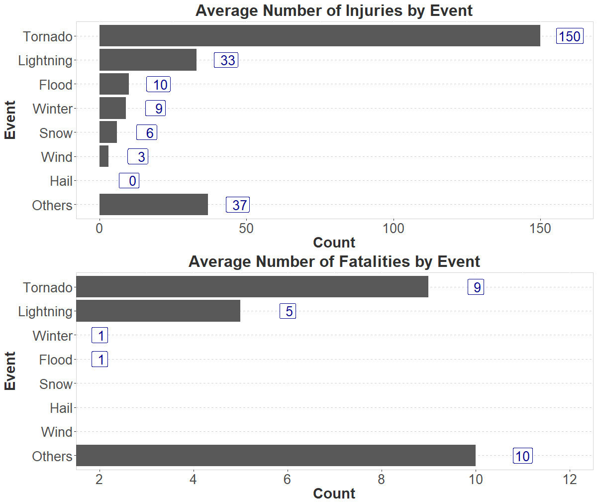

<style type="text/css">
    caption {
      color: #303030;
      font-size: 0.8em;
      text-align: center;
    } 
    table{
      border: 0.75px solid #303030;
      font-size: 14px;
    }
</style>


### **Data Preprocessing**


```r
#=================================== INITIAL DATA CHECKING =======================================#

## Load data
storm <- read_csv("C:/Users/pdonato/Desktop/Coursera/RepData_PeerAssessment2/repdata_data_StormData.csv.bz2")

## Check for missing values. No missing values for EVTYPE, INJURIES, FATALITIES, PROPERTY DMG, and CROP DMG
map_dbl(storm, ~sum(is.na(.)))

## Select only relevant variables
storm <- storm %>%
  select(EVTYPE,INJURIES,FATALITIES,PROPDMG,CROPDMG)

#====================================== EVENTS TAGGING ==========================================#

NWSI_events <- c("Astronomical Low Tide", "Avalanche", "Blizzard", "Coastal Flood", "Cold/Wind Chill", "Debris Flow", "Dense Fog", "Dense Smoke", "Drought", "Dust Devil", "Dust Storm", "Excessive Heat", "Extreme Cold/Wind Chill", "Flash Flood", "Flood", "Frost/Freeze", "Funnel Cloud", "Freezing Fog", "Hail", "Heat", "Heavy Rain", "Heavy Snow", "High Surf", "High Wind", "Hurricane", "Ice Storm", "Lake-Effect Snow", "Lakeshore Flood", "Lightning", "Marine Hail", "Marine High Wind", "Marine Strong Wind", "Marine Thunderstorm Wind", "Rip Current", "Seiche", "Sleet", "Storm Surge/Tide", "Strong Wind", "Thunderstorm Wind", "Tornado", "Tropical Depression", "Tropical Storm", "Tsunami", "Volcanic Ash", "Waterspout", "Wildfire", "Winter Storm", "Winter Weather")

## Get list of unique words
unique_words <- sapply(NWSI_events, function(x) {
                       str_split(x,"/|\\s",simplify=TRUE)
                    }
             ) %>% 
       unlist() %>%
       as.character() %>%
       unique() 

## Manually remove adjectives
unique_words <- unique_words[!unique_words %in% c("Astronomical","Low","Coastal","Cold","Dense","Excessive","Extreme","Heavy","Strong","High","Flash","Thunderstorm")]

## For each unique word, count the number of times it appeared on EVTYPE
## Note that for WINTER STORM, it will count 1 for Winter, and another 1 for Storm.
## For FLOODING, it will count 1 for Flooding.
## For WINDS, it will count 1 for Wind.
word_freq <- sapply(unique_words, function(x) {
                       str_count(toupper(storm$EVTYPE),paste0("\\b",toupper(x),"\\b","|",toupper(x),"(S|ING)"))
                    }
             ) %>%
            colSums() %>%
            as.data.frame() %>% 
            rownames_to_column(var="event")

## Get the top 7 events by occurence
top_events <- word_freq %>% top_n(7) %>% select(event)

## Tag the individual EVTYPE based on the top 7 events, all others are tagged as Others.
storm <- storm %>%
  mutate(TAG = case_when(
                  str_detect(toupper(EVTYPE), 
                             paste0("\\b",toupper(top_events[1,]),"\\b","|",toupper(top_events[1,]),"(S|ING)")) ~ top_events[1,],
                  str_detect(toupper(EVTYPE), 
                             paste0("\\b",toupper(top_events[2,]),"\\b","|",toupper(top_events[2,]),"(S|ING)"))  ~ top_events[2,],
                  str_detect(toupper(EVTYPE), 
                             paste0("\\b",toupper(top_events[3,]),"\\b","|",toupper(top_events[3,]),"(S|ING)"))  ~ top_events[3,],
                  str_detect(toupper(EVTYPE), 
                             paste0("\\b",toupper(top_events[4,]),"\\b","|",toupper(top_events[4,]),"(S|ING)"))  ~ top_events[4,],
                  str_detect(toupper(EVTYPE), 
                             paste0("\\b",toupper(top_events[5,]),"\\b","|",toupper(top_events[5,]),"(S|ING)"))  ~ top_events[5,],
                  str_detect(toupper(EVTYPE),
                             paste0("\\b",toupper(top_events[6,]),"\\b","|",toupper(top_events[6,]),"(S|ING)"))  ~ top_events[6,],
                  str_detect(toupper(EVTYPE), 
                             paste0("\\b",toupper(top_events[7,]),"\\b","|",toupper(top_events[7,]),"(S|ING)"))  ~ top_events[7,],
                  TRUE ~ "Others"
         )
  )

storm$TAG <- factor(storm$TAG,levels = c(top_events[1:7,],"Others"))
```

### **Inital Summary**

```r
total <- storm %>%
  group_by(TAG) %>%
  summarise(tot_inc = n(), tot_fat = sum(FATALITIES), tot_inj = sum(INJURIES), tot_dmg = sum(PROPDMG + CROPDMG))

total$tot_dmg <- scales::dollar(total$tot_dmg)

kable(total, 
      col.names = c("Events","No. of Incidents","No. of Fatalities","No. of Injuries","Total Economic Damage"),
      format.args = list(big.mark = ","),
      caption = "Table 1. Health and Economic Damage based on Event Category",
      align = "cllll") %>% 
  kable_styling(bootstrap_options = c("striped", "hover"), full_width = F, font_size = 15) %>% 
  row_spec(0, align = "c")
```

<table class="table table-striped table-hover" style="font-size: 15px; width: auto !important; margin-left: auto; margin-right: auto;">
<caption style="font-size: initial !important;">Table 1. Health and Economic Damage based on Event Category</caption>
 <thead>
  <tr>
   <th style="text-align:center;text-align: center;"> Events </th>
   <th style="text-align:left;text-align: center;"> No. of Incidents </th>
   <th style="text-align:left;text-align: center;"> No. of Fatalities </th>
   <th style="text-align:left;text-align: center;"> No. of Injuries </th>
   <th style="text-align:left;text-align: center;"> Total Economic Damage </th>
  </tr>
 </thead>
<tbody>
  <tr>
   <td style="text-align:center;"> Flood </td>
   <td style="text-align:left;"> 82,723 </td>
   <td style="text-align:left;"> 1,524 </td>
   <td style="text-align:left;"> 8,604 </td>
   <td style="text-align:left;"> $2,800,638 </td>
  </tr>
  <tr>
   <td style="text-align:center;"> Wind </td>
   <td style="text-align:left;"> 364,657 </td>
   <td style="text-align:left;"> 1,433 </td>
   <td style="text-align:left;"> 11,493 </td>
   <td style="text-align:left;"> $3,357,566 </td>
  </tr>
  <tr>
   <td style="text-align:center;"> Hail </td>
   <td style="text-align:left;"> 289,276 </td>
   <td style="text-align:left;"> 15 </td>
   <td style="text-align:left;"> 1,371 </td>
   <td style="text-align:left;"> $1,270,784 </td>
  </tr>
  <tr>
   <td style="text-align:center;"> Snow </td>
   <td style="text-align:left;"> 17,548 </td>
   <td style="text-align:left;"> 163 </td>
   <td style="text-align:left;"> 1,122 </td>
   <td style="text-align:left;"> $154,180 </td>
  </tr>
  <tr>
   <td style="text-align:center;"> Lightning </td>
   <td style="text-align:left;"> 15,764 </td>
   <td style="text-align:left;"> 817 </td>
   <td style="text-align:left;"> 5,232 </td>
   <td style="text-align:left;"> $607,005 </td>
  </tr>
  <tr>
   <td style="text-align:center;"> Tornado </td>
   <td style="text-align:left;"> 60,697 </td>
   <td style="text-align:left;"> 5,636 </td>
   <td style="text-align:left;"> 91,407 </td>
   <td style="text-align:left;"> $3,315,774 </td>
  </tr>
  <tr>
   <td style="text-align:center;"> Winter </td>
   <td style="text-align:left;"> 19,595 </td>
   <td style="text-align:left;"> 277 </td>
   <td style="text-align:left;"> 1,876 </td>
   <td style="text-align:left;"> $153,123 </td>
  </tr>
  <tr>
   <td style="text-align:center;"> Others </td>
   <td style="text-align:left;"> 52,037 </td>
   <td style="text-align:left;"> 5,280 </td>
   <td style="text-align:left;"> 19,423 </td>
   <td style="text-align:left;"> $603,256 </td>
  </tr>
</tbody>
</table>

### **Health Impact**

```r
inj <- storm %>%
  group_by(TAG) %>%
  summarise(avg_inj = floor(sum(INJURIES)/n()*100)) %>%
  arrange(avg_inj)

inj2 <- rbind(inj %>% filter(TAG=="Others"), inj %>% filter(TAG!="Others"))

inj2$TAG <- factor(inj2$TAG, levels = inj2$TAG)

inj_plot <- ggplot(inj2, aes(x=TAG,y=avg_inj)) + 
  geom_bar(stat="identity") +
  coord_flip() +
  ggtitle("Average Number of Injuries by Event") +
  xlab("Event") +
  ylab("Count") +
  geom_label(aes(x=TAG, y=avg_inj, 
                 label=paste0(avg_inj %>% format(big.mark=","))),
            nudge_y = 10,
            color = "darkblue",
            show.legend = FALSE,
            size=7) +
  theme(axis.text.x = element_text(vjust = 0.5,size=20),
        text = element_text(family = "sans", color = "#303030", size = 20),
        title = element_text(face = "bold", color = "#303030", size = 23),
        axis.text=element_text(size=20),
        axis.title = element_text(size=22, face="bold"),
        plot.title = element_text(size=24, hjust = 0.5),
        plot.subtitle = element_text(face="italic"),
        plot.caption = element_text(hjust = 0, size=22, color ="#3A5199",face="italic"),
        panel.background = element_rect(fill="white", color ="#D3D3D3"),
        panel.grid.major.y = element_line(colour="#D3D3D3",linetype = "dashed"),
        strip.text.x = element_text(size = 20))

fat <- storm %>%
  group_by(TAG) %>%
  summarise(avg_fat = floor(sum(FATALITIES)/n()*100)) %>%
  arrange(avg_fat)

fat2 <- rbind(fat %>% filter(TAG=="Others"), fat %>% filter(TAG!="Others"))

fat2$TAG <- factor(fat2$TAG, levels = fat2$TAG)

fat_plot <- ggplot(fat2, aes(x=TAG,y=avg_fat)) + 
  geom_bar(stat="identity") +
  ggtitle("Average Number of Fatalities by Event") +
  xlab("Event") +
  ylab("Count") +
  geom_label(aes(x=TAG, y=avg_fat, 
                 label=paste0(avg_fat %>% format(big.mark=","))),
            nudge_y = 1,
            color = "darkblue",
            show.legend = FALSE,
            size=7) +
  coord_flip(ylim = c(2,12)) +
  scale_y_continuous(breaks=seq(2,12,2)) +
  theme(axis.text.x = element_text(vjust = 0.5,size=20),
        text = element_text(family = "sans", color = "#303030", size = 20),
        title = element_text(face = "bold", color = "#303030", size = 23),
        axis.text=element_text(size=20),
        axis.title = element_text(size=22, face="bold"),
        plot.title = element_text(size=24, hjust = 0.5),
        plot.subtitle = element_text(face="italic"),
        plot.caption = element_text(hjust = 0, size=22, color ="#3A5199",face="italic"),
        panel.background = element_rect(fill="white", color ="#D3D3D3"),
        panel.grid.major.y = element_line(colour="#D3D3D3",linetype = "dashed"),
        strip.text.x = element_text(size = 20))

grid.arrange(inj_plot,fat_plot,ncol=1)
```

<!-- -->

### **Economic Impact**

```r
# total <- storm %>%
#   group_by(TAG) %>%
#   summarise(tot_inc = n(), tot_fat = sum(FATALITIES), tot_inj = sum(INJURIES), tot_dmg = sum(PROPDMG + CROPDMG))
# 
# total$tot_dmg <- scales::dollar(total$tot_dmg)
# 
# kable(total, 
#       col.names = c("Events","No. of Incidents","No. of Fatalities","No. of Injuries","Total Economic Damage"),
#       format.args = list(big.mark = ","),
#       caption = "Table 1. Health and Economic Damage based on Event Category",
#       align = "cllll") %>% 
#   kable_styling(bootstrap_options = c("striped", "hover"), full_width = F, font_size = 15) %>% 
#   row_spec(0, align = "c")
```
